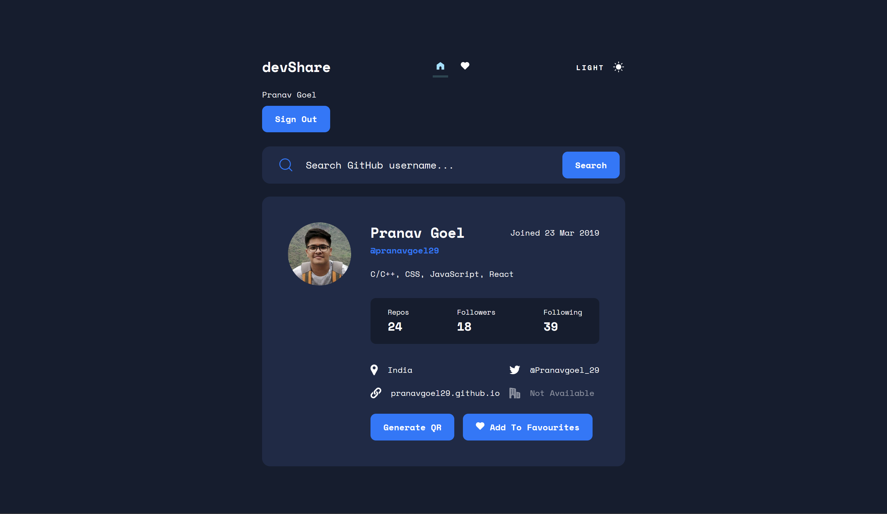
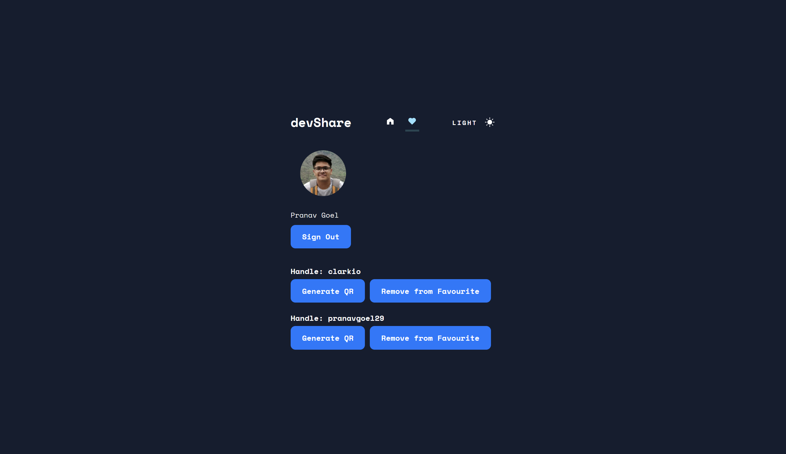
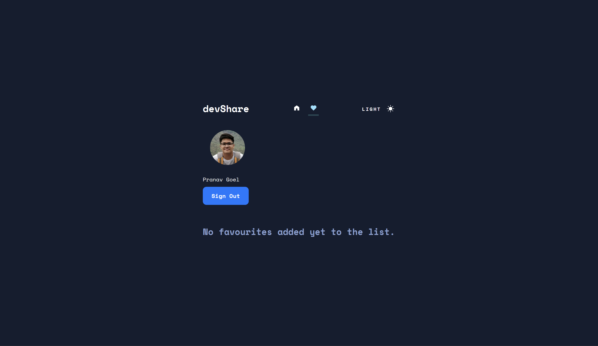
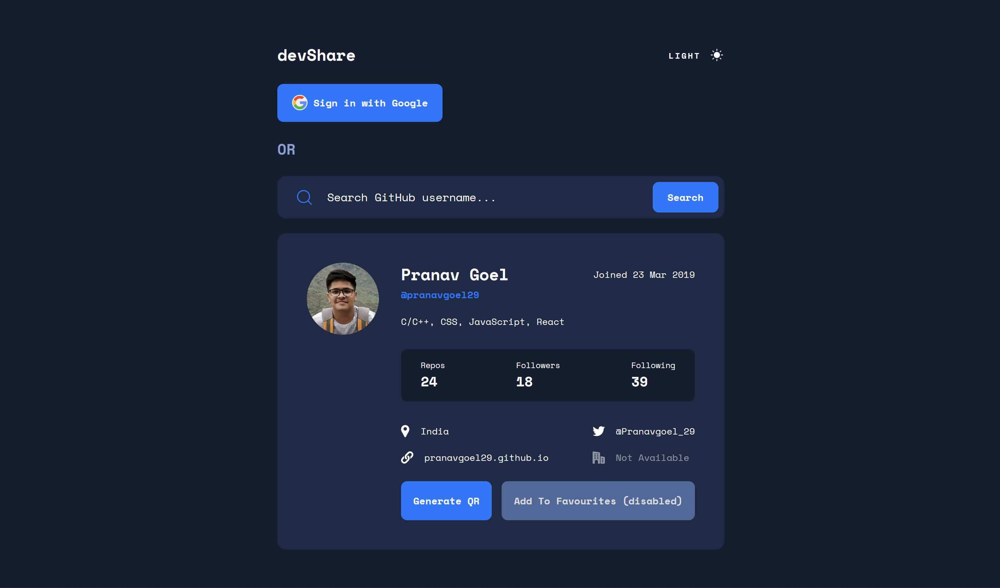
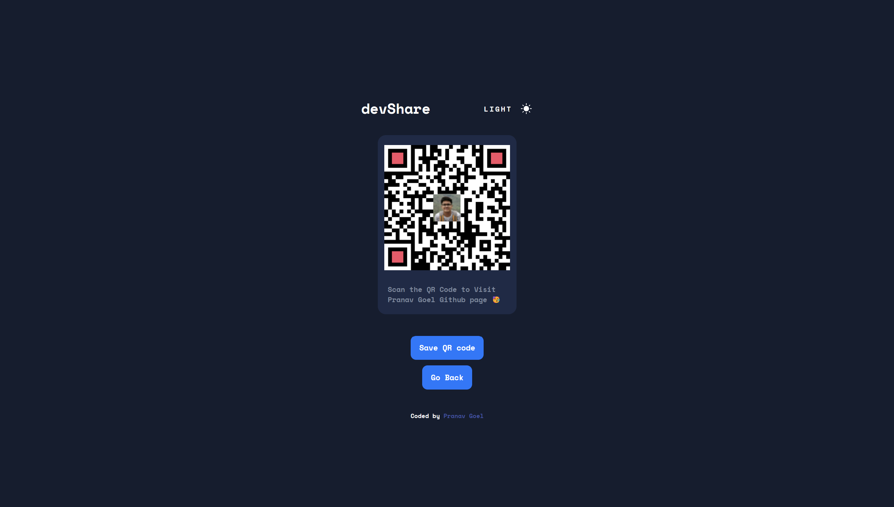

    <h1>devShare</h1>

This is one place where you can manage your favorite Developers who are present on GitHub and easily share their profile through QR-Code.

There are two modes of the application, one is logged in and second is not logged in. Loged-in users have the option of adding favorites.

 

## 🚀Features

- Light/dark mode toggle
- Favourites
- QR-code generation of GitHub profile

## 📦About Project

Tech Stack:
- JavaScript
- Firebase

Home page has four functions: to login the user, generate QR-code, search for GitHub profiles and  add the same to ‘Favourites’. Firebase is used for managing users and FireStore database is used for managing Favourites data.

### 🎨Theme Management
`localstorage` is used to store the value and is used in initTheme() function and to detect user’s system default theme `prefers-color-scheme` CSS media feature is used, `initTheme()` function is called to check default or preferred theme.

### 🀫QR-Code

`easy.qrcode.min.js` package is used to generate GitHub profile QR-code and `html2canval` package is used to screenshot the card canvas of same.

 

## 📷Screenshots
- When signed-in
    

    

    

- When signed-out
    

- QR-code page
    

## 🐛Bug Reporting
Feel free to [open an issue](https://github.com/pranavgoel29/devShare-github/issues) on GitHub if you find any bug.

## 📜 License

This software is open source, licensed under the [MIT License](https://github.com/pranavgoel29/devShare-github/blob/main/LICENSE).